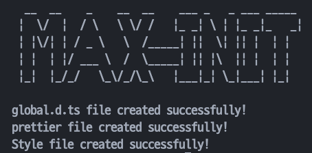

# MAX INIT



개인적으로 사용하려고 만들었습니다.

초기설정 파일 입니다.

# v0.0.1 (Test)

- css reset
- prettier
- global.d.ts

# Feature

- next.js 초기설정
- next.js 초기설정할 때 tailwind가 있다면 tailwind 코드가 포함된 global.css로 설치 reset은 필요없음
- next.js 서버로직 추가 예정
- package.json => Next.js13 에 적합한 라이브러리 업데이트 예정

<br />

# 실행방법

## 1. 원하는 경로에 클론을 받습니다

```
https://github.com/Goldenprevue/max-execution.git
```

<br />
<br />

## 2. src경로가 포함된 Next.js를 설치를 하고 아래 명령어로 인스톨합니다

```
npm install --save-dev @babel/plugin-transform-property-mutators cli-spinners figlet @babel/core @babel/cli
```

내용은 트렌스컴파일을 위한 바벨, cli ui가 포함 되어있습니다.

<br />
<br />

## 3. 클론받은 파일 'max.js'만 package.json과 같은 경로에 붙여넣기 합니다

터미널에 아래 명령어를 작성하고 실행 시켜줍니다.
(yarn 인스톨까지 했다면 max.js는 자동적으로 삭제가 됩니다.)

```
node max.js
```
